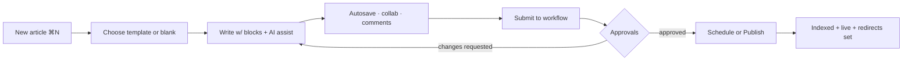
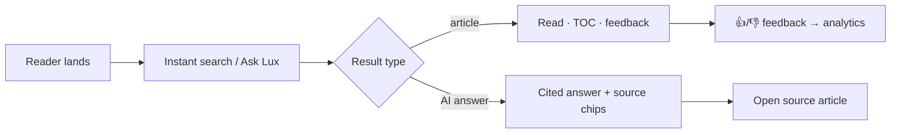
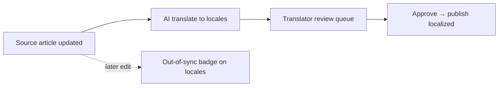

# 5. UX Specification

World-class UX inspired by Linear, Notion, Vercel, GitHub, Stripe, Figma, Apple, and Arc — calm surfaces, decisive accents, keyboard-first, and fully responsive/accessible.

---

## 5.1 Information Architecture

```
Lumina
├── Global Nav (⌘K palette, workspace switcher, search, notifications, avatar)
├── Portal (authenticated)
│   ├── Home / Dashboard
│   ├── Knowledge Base
│   │   ├── Category tree (nested, drag-drop)
│   │   ├── Article list (filters, health, status)
│   │   └── Editor
│   ├── Search
│   ├── AI Assistant (Lux)
│   ├── Workflow (my tasks, approvals, board)
│   ├── Analytics
│   ├── Localization
│   ├── Integrations
│   └── Settings
│       ├── Workspace (branding, domains, locales)
│       ├── Members & Roles
│       ├── AI (models, governance)
│       └── API & Webhooks
├── Admin Console (org-level: billing, security, audit, feature flags)
├── Super Admin (platform ops)
└── Reader / Docs Site (public/private delivery)
```

## 5.2 Navigation Model

- **Three-pane portal:** left rail (nav) · content list (context) · main pane (editor/detail). Collapsible rails; remembers state.
- **Workspace switcher** top-left (like Slack/Linear) with search.
- **Command palette (⌘K):** navigate, create, search, run AI, change settings — fuzzy, recent, and contextual actions.
- **Breadcrumbs** everywhere; deep-linkable URLs; back/forward safe.
- **Reader nav:** left category tree, right on-page TOC, top search + locale + theme.

## 5.3 Key User Flows

### 5.3.1 Author → Publish


### 5.3.2 Reader → Answer


### 5.3.3 Translate


## 5.4 Editor UX Details

- **Block hover handle** (⋮⋮) for drag, duplicate, delete, turn-into, comment, AI.
- **Slash menu** grouped (Basic, Media, Embeds, Advanced, AI) with search + recents.
- **Selection toolbar:** format + "Ask Lux" (rewrite/improve/translate/explain).
- **Right panel tabs:** Comments · Version history · Info (metadata, health, SEO) · AI.
- **Presence:** avatars + colored cursors; "X is editing" indicators; conflict-free via CRDT.
- **Focus mode** (hide chrome), **zen typing**, **split preview**, **outline** navigator.
- **Autosave** indicator ("Saved · 2s ago"); offline badge with queued-sync state.

## 5.5 Dashboard UX

- Personalized: "Your tasks," "Needs review," "Stale content," "Top articles," "AI usage."
- Editable widget grid; per-role default layouts.
- Beautiful, restrained data-viz using the categorical palette; skeleton loaders; empty states with a clear next action.

## 5.6 AI Assistant (Lux) UX

- **Docked side panel** (glassmorphic, `--ai-glow` hairline) + full-screen mode.
- Streaming answers; **provenance chips** under each answer; "Sources (3)" expandable.
- Suggested prompts contextual to current article/KB.
- Actions inline (Insert, Copy, Create draft, Add tag) via function calling.
- Model selector (if permitted) + token/cost meter for admins.
- Clear "AI-generated" labeling and confidence; feedback thumbs to improve.

## 5.7 Search UX

- **Instant** overlay (⌘/ or click): as-you-type, grouped by KB, keyboard nav (↑↓⏎), recent + suggested.
- Tabs: **All · Articles · AI Answer**. AI answer tab shows cited response.
- Facets: KB, category, tag, locale, updated, author.
- Zero-result state → "Ask Lux" + "Suggest this content" (feeds content-gap analytics).

## 5.8 Motion & Feedback

- Transitions 150–250ms ease-out; springy micro-interactions (Framer Motion) on hover/drag/insert.
- Toasts for outcomes; optimistic UI with rollback on failure.
- `prefers-reduced-motion` disables non-essential animation.

## 5.9 Responsive & Mobile

- Portal collapses to single-pane with bottom tab bar on mobile; editor supports touch block handles.
- Reader is mobile-first: sticky search, collapsible TOC, large tap targets, offline-cached recent articles.
- Breakpoints: `sm 640 · md 768 · lg 1024 · xl 1280 · 2xl 1536`.

## 5.10 Accessibility UX

- Skip-to-content, landmark regions, ARIA live for autosave/search results.
- Keyboard map documented and discoverable (`?` shortcut opens cheat sheet).
- Color-independent status (icons + text), AA contrast, visible focus, RTL mirroring.

## 5.11 Empty, Loading & Error States

- **Empty:** illustration + one-line value + primary CTA (+ "Ask Lux" where relevant).
- **Loading:** skeletons matching final layout; never layout shift.
- **Error:** cause + fix + retry; non-blocking for read paths; support link.
