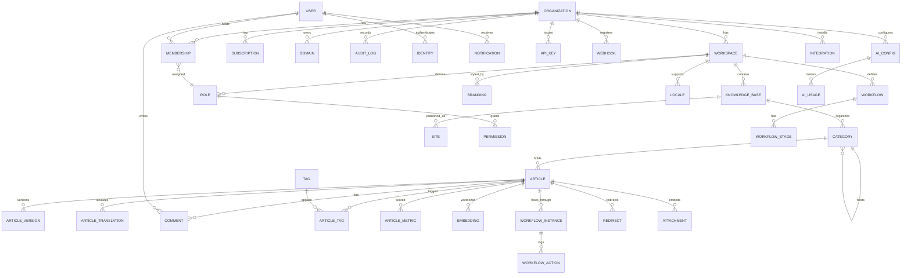

# 7. Database Schema (ERD)

**Primary store:** PostgreSQL 16 with `pgvector`, sharded by `tenant_id` via Citus. Every tenant-scoped table carries `tenant_id` (org) with **Row-Level Security** enforcing isolation. IDs are UUID v7 (time-ordered) unless noted. Timestamps are `timestamptz`. Soft-delete via `deleted_at` where relevant.

Supporting stores: **OpenSearch** (search index), **Qdrant/pgvector** (embeddings), **ClickHouse** (analytics events), **Redis** (cache/sessions), **S3/MinIO** (blobs).

---

## 7.1 Entity-Relationship Diagram (core)

---

## 7.2 Tables (selected, with keys & indexes)

### Identity & Tenancy

**organization**
| col | type | notes |
|-----|------|------|
| id | uuid PK | |
| slug | citext UNIQUE | |
| name | text | |
| plan | text | free/pro/business/enterprise |
| data_region | text | us/eu/apac |
| settings | jsonb | |
| created_at, updated_at, deleted_at | timestamptz | |
Indexes: `slug`, `plan`.

**workspace** — `id PK`, `org_id FK→organization`, `slug`, `name`, `type`, `settings jsonb`, `created_at`. Idx: `(org_id, slug) UNIQUE`.

**user** — `id PK`, `email citext UNIQUE`, `name`, `avatar_url`, `status`, `mfa_enabled bool`, `last_login_at`. Global (cross-org) identity; org access via membership.

**identity** — `id PK`, `user_id FK`, `provider` (password/google/microsoft/github/saml/oidc/passkey), `provider_uid`, `credential jsonb`. Idx: `(provider, provider_uid) UNIQUE`.

**membership** — `id PK`, `org_id FK`, `workspace_id FK NULL`, `user_id FK`, `role_id FK`, `status`, `attributes jsonb` (ABAC), `invited_by`, `created_at`. Idx: `(org_id,user_id)`, `(workspace_id,user_id)`.

**role** — `id PK`, `workspace_id FK NULL` (null = org/system role), `name`, `is_system bool`, `permissions text[]`. **permission** — enumerated capability strings (e.g., `article:publish`, `ai:use`, `settings:manage`).

### Content

**knowledge_base** — `id PK`, `workspace_id FK`, `tenant_id`, `slug`, `name`, `type` (public/private/internal/api/wiki/...), `visibility`, `default_locale`, `settings jsonb`. Idx: `(workspace_id,slug) UNIQUE`.

**category** — `id PK`, `kb_id FK`, `tenant_id`, `parent_id FK→category NULL`, `slug`, `name`, `order int`, `icon`, `path ltree`. **Unlimited nesting** via `parent_id` + `ltree path` for fast subtree queries. Idx: GIST(`path`), `(kb_id,parent_id,order)`.

**article** — 
| col | type | notes |
|-----|------|------|
| id | uuid PK | |
| tenant_id | uuid | shard key, RLS |
| kb_id | uuid FK | |
| category_id | uuid FK NULL | |
| slug | text | |
| title | text | |
| excerpt | text | |
| content | jsonb | block/ProseMirror doc |
| content_md | text | rendered markdown (search/export) |
| status | text | draft/review/approved/published/archived/expired |
| visibility | text | inherits/override |
| locale | text | source locale |
| author_id | uuid FK | |
| owner_id | uuid FK | |
| current_version_id | uuid FK | |
| published_at, expires_at, review_due_at | timestamptz | |
| seo | jsonb | meta/OG/canonical |
| reading_time_sec | int | |
| created_at, updated_at, deleted_at | timestamptz | |
Indexes: `(kb_id, slug) UNIQUE per locale`, `(tenant_id, status)`, `(category_id)`, GIN(`content_md gin_trgm`), `(published_at)`.

**article_version** — `id PK`, `article_id FK`, `tenant_id`, `version_no int`, `content jsonb`, `content_md`, `author_id`, `label`, `parent_version_id` (branch), `created_at`. Immutable. Idx: `(article_id, version_no)`.

**article_translation** — `id PK`, `article_id FK`, `locale`, `title`, `content jsonb`, `status`, `translated_by`, `reviewed_by`, `source_version_id` (for out-of-sync detection), `machine bool`. Idx: `(article_id, locale) UNIQUE`.

**tag** — `id PK`, `workspace_id FK`, `name`, `color`. **article_tag** — `(article_id, tag_id) PK`.

**attachment** — `id PK`, `tenant_id`, `article_id FK NULL`, `kb_id FK`, `filename`, `mime`, `size_bytes`, `storage_key`, `checksum`, `scan_status`, `width/height/duration`, `created_by`. Blob in S3; row is metadata.

**snippet** / **variable** — reusable content: `id PK`, `workspace_id FK`, `key`, `value jsonb`, `scope`. **template** — starter documents.

**redirect** — `id PK`, `kb_id FK`, `from_path`, `to_path`, `type` (301/302), `created_at`. Idx: `(kb_id, from_path) UNIQUE`.

### Metrics & Health

**article_metric** — `id PK`, `article_id FK`, `tenant_id`, `health_score`, `ai_quality_score`, `difficulty_score`, `popularity_score`, `freshness_score`, `views_30d`, `feedback_up`, `feedback_down`, `computed_at`. Denormalized rollup; recomputed via jobs.

**embedding** — `id PK`, `tenant_id`, `article_id FK`, `chunk_no int`, `content text`, `vector vector(1536)`, `model`, `locale`. Idx: `HNSW(vector)` (pgvector) or mirrored to Qdrant collection `tenant:{id}`.

### Workflow

**workflow** — `id PK`, `workspace_id FK`, `name`, `definition jsonb` (states/transitions/gates). **workflow_stage** — stage rows (name, order, approver roles, sla_hours, parallel bool).
**workflow_instance** — `id PK`, `article_id FK`, `workflow_id FK`, `current_stage`, `status`, `started_at`, `due_at`. **workflow_action** — `id PK`, `instance_id FK`, `stage`, `actor_id`, `action` (approve/reject/comment/reassign), `at`.

### Collaboration

**comment** — `id PK`, `article_id FK`, `tenant_id`, `author_id`, `body`, `anchor jsonb` (block/range), `thread_id`, `resolved bool`, `parent_id`, `created_at`. Idx: `(article_id, resolved)`.
**suggestion** — tracked-change proposals: `id PK`, `article_id`, `author_id`, `diff jsonb`, `status`.
**mention** — `(comment_id, user_id)`.

### Delivery / Branding

**site** — `id PK`, `kb_id FK`, `domain_id FK NULL`, `theme jsonb`, `nav jsonb`, `homepage jsonb`, `visibility`, `password_hash NULL`. **branding** — `id PK`, `workspace_id FK`, `logo_url`, `colors jsonb`, `fonts jsonb`, `custom_css`. **domain** — `id PK`, `org_id FK`, `hostname UNIQUE`, `verified bool`, `tls_status`.
**locale** — `id PK`, `workspace_id FK`, `code`, `name`, `rtl bool`, `is_default bool`, `fallback`.

### AI

**ai_config** — `id PK`, `workspace_id FK`, `provider`, `model`, `endpoint`, `api_key_ref` (Vault ref), `embedding_model`, `governance jsonb` (allowlist, pii_redaction, log_retention, opt_out_training). **ai_usage** — `id PK`, `tenant_id`, `workspace_id`, `feature`, `model`, `prompt_tokens`, `completion_tokens`, `cost_usd`, `latency_ms`, `user_id`, `at`. Idx: `(tenant_id, at)` (also mirrored to ClickHouse).
**ai_conversation** / **ai_message** — assistant chat history with source citations.

### Access, Audit, Platform

**api_key** — `id PK`, `org_id FK`, `name`, `hash`, `scopes text[]`, `rate_limit`, `last_used_at`, `expires_at`, `revoked bool`. **oauth_app** — third-party app registrations.
**webhook** — `id PK`, `org_id FK`, `url`, `events text[]`, `secret_ref`, `active bool`. **webhook_delivery** — attempts/status.
**audit_log** — `id PK`, `org_id`, `actor_id`, `action`, `resource_type`, `resource_id`, `metadata jsonb`, `ip`, `ua`, `hash_prev` (hash-chained/tamper-evident), `at`. Idx: `(org_id, at)`, `(resource_type, resource_id)`. Partitioned monthly.
**integration** — `id PK`, `workspace_id FK`, `provider`, `config jsonb`, `tokens_ref`, `status`.
**notification** — `id PK`, `user_id FK`, `type`, `payload jsonb`, `read_at`, `channel`, `created_at`. Idx: `(user_id, read_at)`.
**subscription** / **invoice** / **usage_meter** — billing (seats, storage_bytes, ai_tokens, article_count) per org/period.
**feature_flag** — `id PK`, `scope` (global/org/workspace), `key`, `value jsonb`.

---

## 7.3 Indexing & Scalability Strategy

- **Sharding:** Citus distributes tenant-scoped tables by `tenant_id`; co-located joins (article + versions + metrics + embeddings share the shard) avoid cross-shard traffic. Reference tables (plans, feature flags) replicated.
- **RLS:** `USING (tenant_id = current_setting('app.tenant')::uuid)` on every tenant table; app sets `app.tenant` per request. Defense-in-depth on top of app-level ABAC.
- **Hot paths indexed:** article lookups by `(kb_id, slug, locale)`, status filters, category subtree (`ltree` GIST), full-text (`gin_trgm`/tsvector), vector (HNSW), audit/analytics by time (partitioned).
- **Partitioning:** `audit_log`, `ai_usage`, `article_version`, analytics events partitioned by time (monthly) for prune/archival.
- **Read replicas** per region; CQRS read models for analytics dashboards (ClickHouse).
- **Archival:** cold versions/attachments tiered to S3 Glacier; embeddings recomputed on model upgrades via background jobs.
- **Integrity:** FK constraints within shard; cross-service references validated via events + eventual consistency (outbox pattern).
