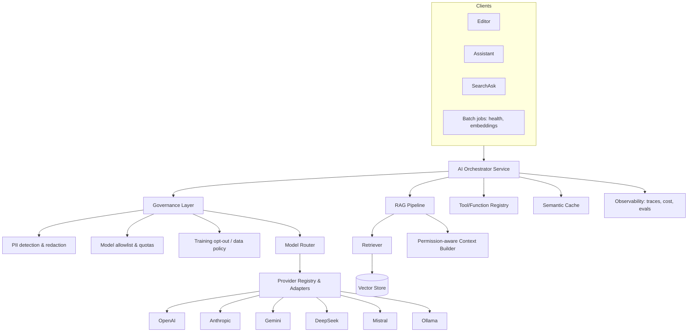
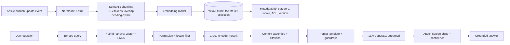

# 9. AI Architecture

Lumina's AI layer ("**Lux**") is model-agnostic, governed, observable, and permission-aware. It powers writing, transformation, translation, search answers, and RAG chat over private enterprise content — with **Bring-Your-Own-LLM** and self-hosted options.

---

## 9.1 Component Overview

## 9.2 Model Router & BYO-LLM

- **Provider adapters** normalize chat/completion/embeddings/streaming/function-calling across OpenAI, Anthropic Claude, Google Gemini, DeepSeek, Mistral, Llama via **Ollama** (self-hosted).
- **Routing policy** (per workspace, configurable): map task → model by capability, cost, latency, and data-sensitivity. E.g. drafting → strong model; tagging/metadata → small fast model; regulated tenant → self-hosted only.
- **Fallback chains:** on provider error/timeout, degrade to next allowed model; circuit breakers per provider.
- **BYO keys:** customers supply their own API keys (stored in Vault, referenced by `ai_config.api_key_ref`) so usage bills to them and data stays under their contracts. Fully self-hosted path via Ollama/vLLM for air-gap-adjacent needs.

## 9.3 RAG Pipeline

**Key properties:**
- **Permission-aware retrieval:** ACL metadata filters candidates *before* generation — private content never leaks to unauthorized users or public site AI.
- **Grounding & citations:** answers cite the exact source chunks; low-confidence/no-context → "I don't have that in the docs" instead of hallucinating.
- **Freshness:** re-embed on publish (<5s); versioned embeddings; stale chunks purged.
- **Locale-aware:** retrieval and answer in the reader's locale (localized AI).
- **Chunking:** heading-aware, table/code-preserving, with overlap; embeddings stored per chunk with back-references to article + version.

## 9.4 AI Capabilities → Implementation

| Capability | Technique |
|------------|-----------|
| Write / rewrite / improve / summarize / expand / explain / tone | Prompt templates + few-shot + style/brand guardrails |
| Translate | LLM translation + glossary/translation-memory injection + human-review loop |
| Convert SOP / generate FAQ / troubleshooting / decision trees | Structured output (JSON schema) + function calling → editor blocks |
| Diagrams / flowcharts | Text→Mermaid/PlantUML generation, validated + rendered |
| Suggest tags/categories, metadata, SEO | Classification + retrieval against existing taxonomy |
| Duplicate detection | Embedding similarity threshold across KB |
| Content health / outdated detection | Signals model: age, traffic, feedback, link-rot, semantic drift vs. product data |
| Release notes | Diff/changelog → summarize by category (feature/fix/breaking) |
| Chat with docs / Q&A | RAG (§9.3) with tools |

## 9.5 Function Calling / Tools

Registered tools the assistant can invoke (permission-checked, audited):
`create_draft`, `insert_block`, `add_tag`, `suggest_category`, `open_workflow`, `search_kb`, `create_translation`, `generate_diagram`, `link_related`, `escalate_to_human`. Each tool has a JSON schema; the orchestrator validates arguments, executes via domain services, and streams results back to the UI.

## 9.6 Governance & Safety

- **PII redaction** on inputs (configurable) before leaving tenant boundary; reversible tokenization where needed.
- **Model allowlist & quotas** per workspace; token/cost budgets with soft/hard limits and alerts.
- **Prompt/response logging** (configurable retention) for audit; **training opt-out** enforced per provider.
- **Moderation:** input/output classification (toxicity, PII leak, policy) with block/flag actions.
- **Prompt-injection defenses:** retrieved content is treated as untrusted data (delimited, never executed as instructions); tool use gated by user permissions; system prompts hardened.
- **Provenance & transparency:** every AI output labeled, cited, with confidence; user feedback captured.

## 9.7 AI Observability & Evaluation

- **Tracing:** per-request spans (retrieval, rerank, generation, tools) with token/cost/latency, tenant-tagged (OpenTelemetry + Langfuse-style store).
- **Evals:** offline + online — groundedness/faithfulness, answer relevance, citation correctness, retrieval recall@k, refusal appropriateness. Regression suite in CI on prompt/model changes.
- **Golden datasets** per tenant category; human-in-the-loop review sampling.
- **Cost analytics:** per feature/model/workspace; semantic cache hit-rate; routing efficiency.

## 9.8 Semantic Caching & Cost Control

- **Semantic cache** (embedding-keyed) for repeated/similar questions → serve cached grounded answers, invalidated on source change. Targets ≥30% token reduction.
- **Prompt compression / context pruning** to fit budgets; small-model routing for cheap tasks; batch embeddings.

## 9.9 Data Flow & Isolation

- Embeddings and AI usage are tenant-scoped (per-tenant vector collections, RLS on `embedding`/`ai_usage`).
- Regulated tenants: self-hosted models + no external egress; residency-pinned vector store.
- No cross-tenant retrieval ever; retrieval filters enforce `tenant_id` + article ACL + locale.
