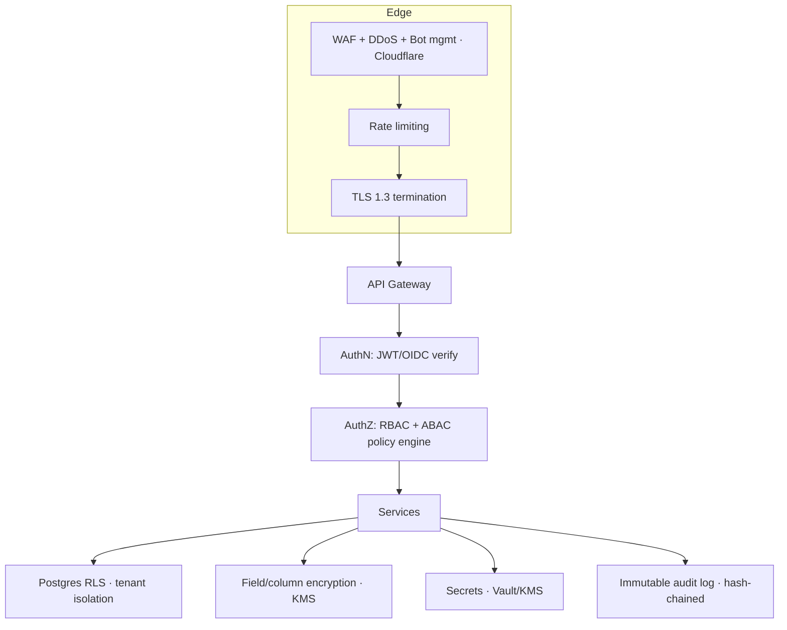

# 10. Security Architecture

Defense-in-depth across identity, authorization, data, network, application, and operations. Deny-by-default everywhere; least privilege; auditable.

---

## 10.1 Security Layers

## 10.2 Identity & Authentication

- **SSO:** SAML 2.0 and OIDC per organization; IdP-initiated + SP-initiated; JIT provisioning; **SCIM 2.0** for lifecycle.
- **Social/enterprise IdPs:** Azure AD/Entra, Google, Microsoft, GitHub.
- **MFA:** TOTP, SMS, email; **passkeys/WebAuthn** (phishing-resistant); step-up auth for sensitive actions (billing, security settings, publishing to public).
- **Sessions:** short-lived access JWT (15m) + rotating, device-bound refresh tokens; refresh reuse detection revokes the family; session list + remote revoke.
- **Password policy:** Argon2id hashing, breach-check (HIBP k-anonymity), configurable complexity, lockout/backoff.

## 10.3 Authorization (RBAC + ABAC)

- **RBAC:** roles → permission sets (e.g., `article:publish`, `ai:configure`, `billing:manage`), scoped at org/workspace/category/article.
- **ABAC:** attribute policies (user attributes, resource sensitivity, locale, IP, time) evaluated by a central policy engine (**Cerbos/OPA**), decisions cached, fully audited.
- **Defense-in-depth:** Postgres **RLS** enforces `tenant_id` isolation independent of app logic; every query runs under the request's tenant/session context.
- **Guest/external:** capability tokens scoped to a resource + expiry; no ambient authority.

## 10.4 Data Protection

- **In transit:** TLS 1.3 everywhere, including service-to-service (mTLS via service mesh).
- **At rest:** AES-256; **per-tenant envelope encryption** with KMS-managed keys; encrypted backups.
- **Field-level encryption** for secrets/PII (API keys, tokens) via KMS; searchable-encryption avoided in favor of tokenization.
- **Key management:** KMS/HSM-backed; rotation schedules; separation of duties; BYOK for enterprise.
- **Data residency:** tenant pinned to region (US/EU/APAC); data plane per region; no cross-region replication of regulated data except DR within jurisdiction.
- **PII minimization & DSR:** automated export/delete (GDPR/CCPA) workflows; retention & legal hold; right-to-be-forgotten cascades incl. embeddings and search indices.

## 10.5 Network & Infrastructure Security

- Private VPCs, segmented subnets; services not internet-exposed except via gateway/ingress.
- **Service mesh** (Istio/Linkerd) with mTLS, authz policies, and zero-trust between services.
- **WAF** (OWASP ruleset), IP allow/deny lists per org, geo controls, bot management, DDoS protection at edge.
- Egress control/allowlists (esp. for AI providers); no wildcard outbound from data plane.
- Container security: distroless images, non-root, read-only FS, seccomp/AppArmor, image signing (cosign), admission control (Kyverno/OPA Gatekeeper).

## 10.6 Application Security

- Input validation (zod/DTOs), output encoding, parameterized queries (Prisma) — SQLi/XSS mitigations.
- CSP, HSTS, CSRF protection, secure/HttpOnly/SameSite cookies, SRI on assets.
- Embed/iframe allowlisting; sanitize user HTML/markdown (DOMPurify) in editor & reader.
- **Prompt-injection & AI abuse** controls (see §9.6): retrieved content treated as untrusted; tools permission-gated.
- Per-tenant + per-key **rate limiting** and quota enforcement; anomaly detection on API usage.
- Dependency security: SCA (Snyk/Dependabot), SBOM, pinned versions, provenance (SLSA).

## 10.7 Secrets Management

- Central **Vault/KMS**; no secrets in code, env files, or images; injected at runtime via CSI driver.
- Automatic rotation for DB creds, API keys, signing keys; short-lived dynamic credentials where possible.
- Webhook/API signing secrets referenced, never stored plaintext.

## 10.8 Audit, Logging & Monitoring

- **Immutable, hash-chained audit logs** (tamper-evident) for all security-relevant events; tenant-scoped export.
- Centralized SIEM (structured logs, correlation IDs, tenant tags); alerting on anomalies (impossible travel, privilege escalation, mass export).
- Admin **impersonation** is explicit, time-boxed, consented, and fully audited.
- Security event runbooks; automated response for known patterns (e.g., token-reuse → revoke family).

## 10.9 Compliance & Governance

- **SOC 2 Type II** and **ISO 27001** control mapping; **GDPR/CCPA** by design; **HIPAA-ready** path (BAA, PHI controls).
- Vendor/subprocessor register; DPA templates; data-flow maps per region.
- Change management, access reviews (quarterly), least-privilege for staff, break-glass procedures.
- **AI governance** (§9.6): model allowlists, logging, opt-out, moderation, DPIA support.

## 10.10 Resilience, Backup & DR

- Automated encrypted backups (PITR for Postgres); cross-AZ + in-region cross-account copies; periodic restore drills.
- **RPO ≤ 5 min, RTO ≤ 30 min**; multi-AZ default, multi-region for enterprise.
- Chaos/DR game-days; documented failover runbooks; degraded-mode guarantees (published docs stay readable if AI/search degrade).

## 10.11 Secure SDLC

- Threat modeling per service; security design reviews; SAST/DAST in CI; secret scanning (gitleaks).
- Pen tests (annual + on major releases); bug bounty; responsible disclosure.
- Least-privilege CI/CD (OIDC to cloud, no long-lived cloud keys); signed artifacts; protected branches; mandatory review.
