# 12. DevOps Pipeline

CI/CD via **GitHub Actions** + **Argo CD** (GitOps). Trunk-based development, short-lived branches, mandatory review, progressive delivery.

---

## 12.1 Pipeline Overview

```mermaid
flowchart LR
    Dev[Push / PR] --> CI[CI: build · test · scan]
    CI --> Preview[Ephemeral preview env]
    Preview --> Review[Code + design + a11y review]
    Review --> Merge[Merge to main]
    Merge --> Build[Build + sign images · SBOM]
    Build --> Push[Push to registry]
    Push --> ArgoDev[Argo CD → Dev]
    ArgoDev --> Staging[Promote → Staging: perf/security/e2e]
    Staging --> Canary[Prod canary 5% → 25% → 100%]
    Canary --> Prod[Production multi-region]
    Prod --> Monitor[SLO watch · auto-rollback]
```

## 12.2 CI Stages (per PR)

1. **Setup & cache** (pnpm, turbo remote cache).
2. **Lint & typecheck** (ESLint, Prettier, `tsc --noEmit`).
3. **Unit tests** (Vitest/Jest) with coverage gate (≥80% core).
4. **Contract tests** (API schemas, GraphQL, Pact for services).
5. **Security scans:** SAST (CodeQL/Semgrep), SCA (Snyk/Dependabot), secret scan (gitleaks), IaC scan (tfsec/Checkov), container scan (Trivy).
6. **a11y tests** (axe on key views), **visual regression** (Chromatic).
7. **Build** apps/services; **ephemeral preview** deploy (namespaced) with seeded data.
8. **E2E smoke** (Playwright) on preview.

## 12.3 CD / Progressive Delivery

- **GitOps:** Argo CD syncs env from Git; image tags updated by pipeline via PR to env repo.
- **Promotion:** Dev (auto on merge) → Staging (perf, DAST, full E2E, load test) → Prod.
- **Progressive rollout:** Argo Rollouts canary (5→25→50→100%) with automated analysis (error rate, latency, SLO); **auto-rollback** on regression. Blue-green for high-risk changes.
- **DB migrations:** expand/contract (backward-compatible), gated, run pre-deploy with locks + timeouts; reversible; verified on staging with prod-scale data.
- **Feature flags** decouple deploy from release; gradual/targeted rollout per tenant.

## 12.4 Quality Gates

| Gate | Requirement |
|------|-------------|
| Coverage | ≥80% core services, no drop |
| Security | No high/critical vulns; SBOM produced; images signed (cosign) |
| Performance | Staging load test within SLO budgets |
| a11y | axe: no serious/critical violations |
| Review | ≥1 approval; CODEOWNERS for sensitive areas |
| Evals (AI) | Groundedness/regression suite pass on prompt/model changes |

## 12.5 Supply Chain Security

- SLSA-aligned builds; signed images + provenance attestations; admission control rejects unsigned/unscanned images.
- Pinned dependencies, lockfiles, reproducible builds; least-privilege OIDC cloud auth (no static keys).

## 12.6 Release Management

- Semantic versioning; changesets for packages; auto-generated changelogs & release notes (dogfood Lumina's AI release-notes feature).
- Deploy windows + freeze controls; on-call ownership; incident runbooks; postmortems (blameless).

## 12.7 Developer Experience

- Monorepo (Turborepo/Nx + pnpm); shared configs; `@lumina/*` packages.
- Local stack via Docker Compose / Tilt (Postgres, Redis, OpenSearch, MinIO, RabbitMQ, Ollama).
- Codegen: Prisma client, GraphQL types, OpenAPI SDKs, design tokens.
- Pre-commit hooks (lint/format/typecheck); PR templates; automated dependency updates.

## 12.8 Environments & Secrets in CI

- Secrets from Vault/GitHub OIDC → cloud; never in logs; masked; environment protection rules + required reviewers for prod.
