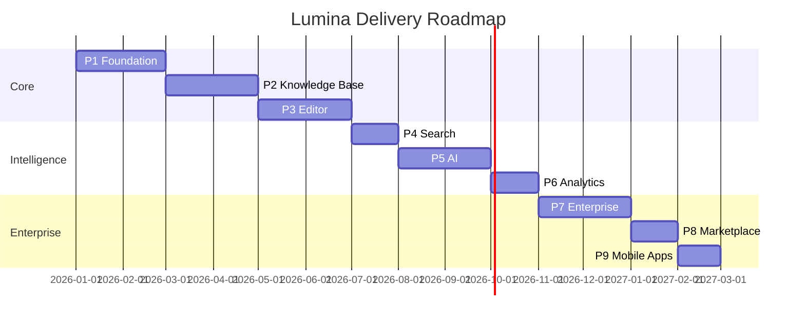

# 13. Development Roadmap

Nine phases, ~14 months to full GA. Each phase lists Objectives, Features, Deliverables, Timeline, Dependencies, Risks, Testing, and Acceptance Criteria. Phases overlap where dependencies allow; teams are cross-functional squads.

---

## Phase 1 — Foundation (Months 1–2)

- **Objectives:** Establish multi-tenant platform skeleton, auth, and CI/CD.
- **Features:** Org/workspace/tenancy model + RLS; auth (password, OAuth/OIDC, SSO scaffolding, MFA, passkeys); RBAC/ABAC engine; API gateway; design system + `@lumina/ui`; base infra (Terraform, EKS, Postgres/Citus, Redis, S3, RabbitMQ); observability.
- **Deliverables:** Working login/SSO, org creation, member/roles, base UI shell, IaC, CI/CD with preview envs.
- **Timeline:** 8 weeks. **Dependencies:** none.
- **Risks:** Tenancy/RLS complexity → mitigate with early load/isolation tests. SSO edge cases → certify against Okta/Azure/Google.
- **Testing:** Tenancy isolation tests, auth flows (unit/e2e), infra smoke, penetration test of auth.
- **Acceptance:** A new org can sign up, configure SSO, invite users with roles; all data tenant-isolated (verified); CI/CD deploys to staging.

## Phase 2 — Knowledge Base (Months 2–4)

- **Objectives:** Content model, categories, articles, delivery sites (read path).
- **Features:** KB types + visibility; nested categories (ltree); article CRUD + status; versioning; tags/metadata/SEO; slug/redirects; public/private/internal reader sites (SSR/ISR); branding; custom domains + TLS.
- **Deliverables:** Author can create KB/categories/articles and publish to a branded site on a custom domain.
- **Timeline:** 8 weeks. **Dependencies:** P1.
- **Risks:** Custom-domain TLS automation; SEO/SSR performance → CDN + ISR early.
- **Testing:** Content CRUD, versioning integrity, redirect correctness, SSR perf (Web Vitals), permission-aware rendering.
- **Acceptance:** Publish → live on custom domain <5 min; versions restorable; private KB gated; Web Vitals within budget.

## Phase 3 — Editor (Months 4–6)

- **Objectives:** World-class collaborative block editor.
- **Features:** Block editor (WYSIWYG+MD), 40+ blocks, slash menu, drag-drop, media/embeds, Mermaid/PlantUML, math, code; snippets/variables/templates/conditional content; **real-time collaboration (CRDT)**, comments, mentions, suggestions, track-changes; autosave, offline, live/split preview; workflow (draft→review→approve→publish, builder, approval matrix, scheduling).
- **Deliverables:** Full authoring + collaboration + workflow.
- **Timeline:** 8 weeks. **Dependencies:** P2.
- **Risks:** CRDT scale/conflict handling; offline sync → prototype early with Yjs; large-doc performance → virtualization.
- **Testing:** Collab concurrency (multi-client), CRDT convergence, offline sync, workflow transitions, editor a11y.
- **Acceptance:** ≥10 concurrent editors converge without loss; workflows enforce approvals; offline edits sync on reconnect.

## Phase 4 — Search (Months 6–7)

- **Objectives:** Enterprise hybrid + semantic search.
- **Features:** OpenSearch indexing pipeline; BM25 + typo/synonyms/analyzers; vector index + embeddings; RRF fusion + cross-encoder rerank; instant/typeahead; related/suggested; permission-aware; search analytics + zero-result gaps; localized search.
- **Deliverables:** Fast, relevant, permission-aware hybrid search across portal and reader.
- **Timeline:** 4 weeks. **Dependencies:** P2/P3 (content + embeddings infra), overlaps P5.
- **Risks:** Index freshness/permission filtering; relevance tuning → eval harness with labeled queries.
- **Testing:** Relevance (nDCG on labeled set), permission-leak tests, latency (<200ms P95), freshness (<5s).
- **Acceptance:** Hybrid search P95 <200ms; no private-content leakage; zero-result analytics populated; relevance ≥ target nDCG.

## Phase 5 — AI (Months 7–9)

- **Objectives:** Governed AI assistant + RAG + BYO-LLM.
- **Features:** AI orchestrator, model router, provider adapters (OpenAI/Claude/Gemini/DeepSeek/Mistral/Ollama), BYO keys; RAG pipeline (chunk/embed/retrieve/rerank/cite); writing/transform/translate/generate; chat with docs (streaming + tools); governance (PII, allowlist, quotas, moderation, opt-out); AI observability + evals; semantic cache.
- **Deliverables:** Lux assistant across editor, search, and reader; per-workspace model config; governance dashboard.
- **Timeline:** 8 weeks. **Dependencies:** P4 (retrieval), P3 (editor integration).
- **Risks:** Hallucination/leakage; cost overrun; provider variability → grounding + citations + permission filters + evals + routing/caching.
- **Testing:** Groundedness/faithfulness evals, citation correctness, prompt-injection red-team, permission-aware retrieval tests, cost/latency load.
- **Acceptance:** Groundedness ≥0.9; zero cross-tenant/private leakage in red-team; streaming first-token <800ms; cost within budget with cache.

## Phase 6 — Analytics (Months 9–10)

- **Objectives:** Full analytics + feedback loops.
- **Features:** Event pipeline (collector→stream→ClickHouse), dashboards (views, visitors, searches, failed searches, popular/low-quality, feedback, NPS, content health, AI usage, productivity, SLA, publishing velocity); exports + scheduled reports; content-gap suggestions.
- **Deliverables:** Analytics dashboards + exports + warehouse feed.
- **Timeline:** 4 weeks. **Dependencies:** P2–P5 (events).
- **Risks:** Event volume/cost; privacy → sampling, tiering, anonymization.
- **Testing:** Pipeline correctness, rollup accuracy, dashboard load, privacy compliance.
- **Acceptance:** Dashboards accurate vs. source-of-truth sampling; exports working; privacy controls verified.

## Phase 7 — Enterprise (Months 10–12)

- **Objectives:** Enterprise governance, compliance, integrations, i18n GA.
- **Features:** SCIM, advanced audit + hash-chaining, data residency, IP allowlists, DR/multi-region GA; full multi-language (auto-translate + review + RTL + localized URLs/search/AI); integrations (Slack, Teams, Jira, GitHub, GitLab, Azure DevOps, Salesforce, Zendesk, Freshdesk, HubSpot, Intercom, Zapier, Power Automate, Drive, OneDrive, Dropbox, SharePoint); billing/subscriptions/usage; admin + super-admin consoles; SOC 2 / ISO 27001 readiness.
- **Deliverables:** Enterprise-ready platform passing security review; integrations live; billing operational.
- **Timeline:** 8 weeks. **Dependencies:** P1–P6.
- **Risks:** Compliance scope; integration breadth → prioritize top integrations, phase the rest; residency complexity → region isolation tested.
- **Testing:** Compliance control tests, SCIM lifecycle, residency isolation, integration e2e, billing accuracy, DR failover drill.
- **Acceptance:** SOC 2 controls in place; residency enforced; top integrations working; DR meets RPO/RTO; billing reconciles.

## Phase 8 — Marketplace (Months 12–13)

- **Objectives:** Extensibility platform + ecosystem.
- **Features:** Plugin/extension API, developer portal, app submission/review, OAuth apps, SDKs (TS/Python/Go), CLI, webhooks GA, template marketplace, revenue share.
- **Deliverables:** Public marketplace + developer portal + SDKs/CLI.
- **Timeline:** 4 weeks. **Dependencies:** P1–P7 (stable APIs).
- **Risks:** Third-party security/isolation → sandboxing, review, scoped permissions.
- **Testing:** Plugin sandbox/security, SDK conformance, marketplace flows.
- **Acceptance:** External dev can publish a reviewed extension using scoped permissions; SDKs/CLI GA.

## Phase 9 — Mobile Apps (Months 13–14)

- **Objectives:** Native mobile (reader + light authoring + assistant).
- **Features:** React Native/Expo apps (iOS/Android): read, search, AI chat, notifications, offline cache, comments/approvals, SSO, passkeys, push.
- **Deliverables:** Published iOS/Android apps.
- **Timeline:** 4 weeks. **Dependencies:** stable APIs (P1–P7).
- **Risks:** Store review, offline sync, push infra → early TestFlight/Play beta.
- **Testing:** Device matrix, offline/push, a11y (mobile), store-compliance.
- **Acceptance:** Apps approved on both stores; core read/search/AI/approvals work offline-tolerant.

---

## Cross-Cutting Workstreams (all phases)

- **Security & Compliance:** threat modeling, pen tests, control implementation.
- **Design System:** evolve `@lumina/ui`, Storybook, a11y.
- **Reliability:** SLOs, observability, chaos/DR drills.
- **AI Evals:** golden datasets, regression suite.
- **Docs & DevRel:** dogfood Lumina for its own docs.

## Team Structure (indicative)

Squads: Platform/Infra, Identity/Security, Content/Editor, Search/AI, Analytics, Enterprise/Integrations, Frontend/Design System, Mobile. Plus PM, Design, QA/SDET, DevOps/SRE, DevRel.
