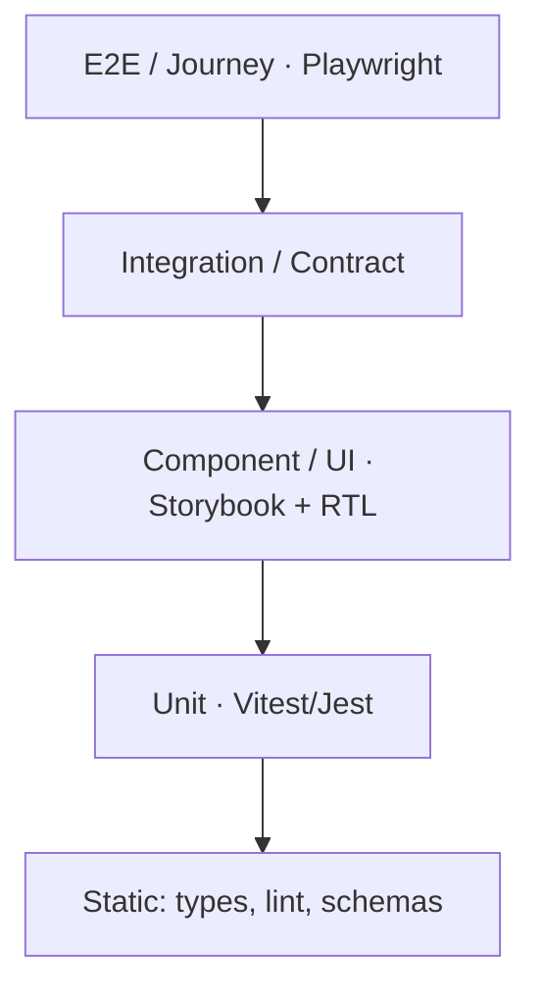

# 14. Testing Strategy

Quality is built-in via a layered test pyramid, continuous verification, and domain-specific suites (search relevance, AI evals, tenancy isolation, a11y, performance, security).

---

## 14.1 Test Pyramid

| Layer | Tooling | Scope | Target |
|-------|---------|-------|--------|
| Static | TS, ESLint, zod, Prisma schema | Types, contracts | 100% typed |
| Unit | Vitest/Jest | Pure logic, services | ≥80% core |
| Component | Storybook play + Testing Library | UI states/interactions | Key components |
| Integration | Supertest, Pact | Service ↔ DB/queue, API contracts | All endpoints |
| E2E | Playwright | Critical journeys | Golden paths |

## 14.2 Critical E2E Journeys

Author→publish; reviewer approval; real-time collab (multi-client); search→answer; AI chat with citations; translate→review→publish; SSO login + MFA; custom-domain reader; billing upgrade; import from Confluence/Notion.

## 14.3 Specialized Suites

- **Tenancy isolation:** automated tests asserting no cross-tenant data access via API, search, AI retrieval, RLS (fuzzed tenant contexts).
- **Search relevance:** labeled query sets → nDCG/MRR/recall@k thresholds; regression on index/analyzer changes; zero-result coverage.
- **AI evals:** groundedness, faithfulness, citation correctness, answer relevance, refusal appropriateness, prompt-injection red-team; golden datasets per category; run in CI on prompt/model changes; online sampling with human review.
- **Accessibility:** axe automated + manual screen-reader passes; keyboard-only journeys; contrast/RTL checks; WCAG AA gate.
- **Performance:** k6/Gatling load tests to SLO budgets (search <200ms P95, API <150ms, AI first-token <800ms); soak/stress; editor 60fps profiling; Web Vitals in CI (Lighthouse).
- **Security:** SAST/DAST, SCA, secret scan, container/IaC scan in CI; annual pen test + bug bounty; authz matrix tests (every role × action).
- **Resilience/chaos:** fault injection (provider outage, DB failover, queue backlog); DR restore drills verifying RPO/RTO; degraded-mode guarantees.
- **Contract/backward-compat:** API/GraphQL schema diff gate; consumer-driven contracts between services; migration expand/contract verification.
- **Visual regression:** Chromatic on component + key pages.
- **Localization:** pseudo-localization, RTL layout, locale fallback, translated-content rendering.

## 14.4 Test Data & Environments

- Ephemeral preview env per PR with seeded, anonymized multi-tenant fixtures.
- Staging mirrors prod with prod-scale synthetic data for perf/migration validation.
- Factory-based fixtures; deterministic seeds; PII-free synthetic content generators.

## 14.5 Quality Gates & Governance

- CI blocks merge on: type/lint fail, coverage drop, high/critical vuln, a11y serious violation, failed contract/eval/perf budget.
- Flaky-test quarantine + tracking; test ownership via CODEOWNERS.
- Release readiness checklist (functional, perf, security, a11y, evals, docs).

## 14.6 Observability-Driven Testing

- Synthetic monitors in prod (search, publish, AI answer, login) alert on SLO breach.
- Real-user monitoring feeds regression detection; error-budget policy gates risky releases.
- Canary analysis (error rate/latency/eval score) auto-rolls-back regressions.
