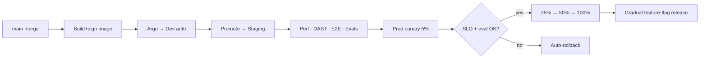

# 15. Deployment Strategy

Zero-downtime, progressive, multi-region delivery via GitOps + Argo Rollouts, with feature flags decoupling deploy from release.

---

## 15.1 Principles

- **Deploy ≠ release:** ship dark behind flags; release by gradual/targeted flag rollout per tenant/cohort.
- **Progressive delivery:** canary with automated analysis + auto-rollback; blue-green for high-risk.
- **Backward-compatible migrations** (expand/contract) so app and schema deploy independently.
- **Immutable, signed artifacts;** GitOps as single source of truth.

## 15.2 Rollout Flow

## 15.3 Multi-Region Deployment

- Regions deployed independently; global control plane coordinates; readers routed to nearest healthy region via GSLB.
- Residency-pinned tenants deploy only in their region; published content served globally from edge.
- Config/flags replicated with region overrides; migrations applied per region with health gates.

## 15.4 Database Migrations

- Prisma migrations, expand/contract pattern; run in pre-deploy job with lock timeouts and statement limits.
- Online schema change tooling for large tables; verified against prod-scale staging; reversible; backfills as background jobs.
- Never a breaking change in a single deploy; two-phase (add nullable → backfill → enforce → drop old).

## 15.5 Feature Flags & Tenant Rollouts

- Flag scopes: global/org/workspace/user; percentage + allowlist targeting; kill-switches for risky features (AI, search).
- Per-tenant staged rollout; instant rollback via flag; experiment framework (A/B) tied to analytics.

## 15.6 Release Types

| Type | Mechanism |
|------|-----------|
| Standard | Canary → ramp |
| High-risk (data path, migrations) | Blue-green + extended canary |
| Hotfix | Fast-track canary with focused checks |
| Config/flag | Instant, no image deploy |

## 15.7 Rollback & Recovery

- Automated rollback on canary SLO/eval regression; one-command revert (previous signed image).
- DB rollbacks avoided via forward-fix; expand/contract makes prior version compatible.
- Runbooks + on-call; incident comms; blameless postmortems.

## 15.8 Tenant Provisioning & Deprovisioning

- Saga provisions: workspace, Postgres tenant context, OpenSearch/vector collection, S3 prefixes, DNS/TLS — atomic with compensations.
- Deprovision: DSR-compliant deletion cascading through DB, indices, embeddings, blobs, backups (per retention/legal hold).

## 15.9 Zero-Downtime Guarantees

- Rolling updates + PDBs + readiness gates; connection draining; graceful shutdown.
- Read path (published docs) never blocked by deploys; degraded-mode for search/AI.
- Maintenance-free customer experience; status page + proactive incident notices.
