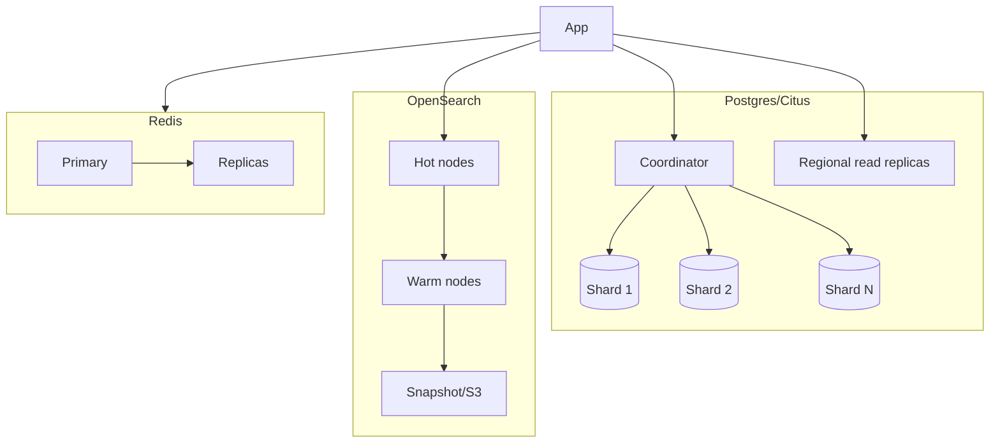

# 16. Scaling Strategy

Designed for **50M+ articles**, **10k+ organizations**, and **100k+ concurrent readers per large tenant**, with linear horizontal scale and no single bottleneck.

---

## 16.1 Scaling Dimensions

| Dimension | Strategy |
|-----------|----------|
| Tenants | Citus sharding by `tenant_id`; per-tenant indices/collections; dedicated cluster for whales |
| Read traffic | CDN edge cache + ISR (≥90% offload); read replicas; edge KV for routes |
| Write/authoring | Stateless services + HPA; CRDT via horizontally-scaled WS pods with sticky rooms |
| Search | OpenSearch cluster scaling, hot/warm tiers, per-tenant/lang shards |
| Vectors | Per-tenant collections, HNSW, sharded vector store (Qdrant) |
| Async work | KEDA scaling on queue depth; scale-to-zero idle |
| AI | Model routing, semantic cache, batching, provider concurrency pools |
| Analytics | ClickHouse sharding + TTL tiering; pre-aggregated rollups |

## 16.2 Data Tier Scaling

- **Sharding:** co-located tenant data (article+versions+metrics+embeddings) → single-shard queries; rebalancing without downtime; whale tenants isolated to dedicated shards/clusters.
- **Read replicas** per region; routing reads to replicas; write to primary.
- **Hot/warm/cold** tiering for search & storage; snapshot archival to S3/Glacier.

## 16.3 Caching Strategy (multi-layer)

1. **Edge/CDN** — published pages (ISR), assets, redirects (edge KV). Purge on publish.
2. **Application cache (Redis)** — sessions, hot articles, permission decisions, config, search suggestions.
3. **Query cache** — dashboards/analytics rollups.
4. **Semantic cache** — AI answers keyed by embedding (invalidate on source change).
5. **HTTP caching** — ETags, `stale-while-revalidate`.

## 16.4 Stateless & Async Scaling

- All domain services stateless (state in DB/Redis) → scale by HPA on RPS/latency.
- WebSocket/CRDT: consistent-hash rooms to pods; horizontal scale with Redis pub/sub fan-out; presence in Redis.
- Workers autoscale on RabbitMQ/BullMQ depth (KEDA); priority queues; backpressure + DLQs; idempotent consumers.

## 16.5 Search & Vector Scaling

- Index per tenant/locale; alias-based reindex (zero-downtime reindex on mapping/model change).
- Vector store per-tenant collections; approximate NN (HNSW) tuned recall/latency; async re-embed on model upgrade (versioned).
- Query-time permission + locale filters pushed to engine to minimize over-fetch.

## 16.6 AI Scaling & Cost

- Provider concurrency pools + rate-limit-aware queuing; fallback chains; batch embeddings.
- Semantic cache + prompt compression + small-model routing cut token spend ≥30%.
- Self-hosted (Ollama/vLLM on GPU pools) autoscaled for regulated/high-volume tenants.

## 16.7 Multi-Region Scaling

- Active-active regions; tenant residency pinning; global control plane, regional data planes.
- GSLB + edge routing for locality; published content globally cached.
- Cross-region only for DR within jurisdiction.

## 16.8 Capacity Planning & Load Management

- Per-tenant quotas (rate limits, storage, AI tokens, doc counts) with fair-use + burst.
- Autoscaling policies from load-test-derived headroom; predictive scaling for known peaks.
- Bulkheads/circuit breakers isolate failures; graceful degradation (search/AI optional, reading always available).

## 16.9 Scaling Milestones

| Scale | Approach |
|-------|----------|
| 1k orgs / 1M docs | Single-region, few shards, standard clusters |
| 10k orgs / 10M docs | Multi-shard Citus, per-tenant indices, regional replicas |
| 10k+ orgs / 50M+ docs | Multi-region, whale isolation, tiered storage, dedicated AI pools |
