# System Architecture — LUMINA

Lumina is a **cloud-native, multi-tenant, microservices** platform deployed on Kubernetes across multiple regions. This document presents the end-to-end architecture with diagrams for every major subsystem.

---

## 1. High-Level System Architecture

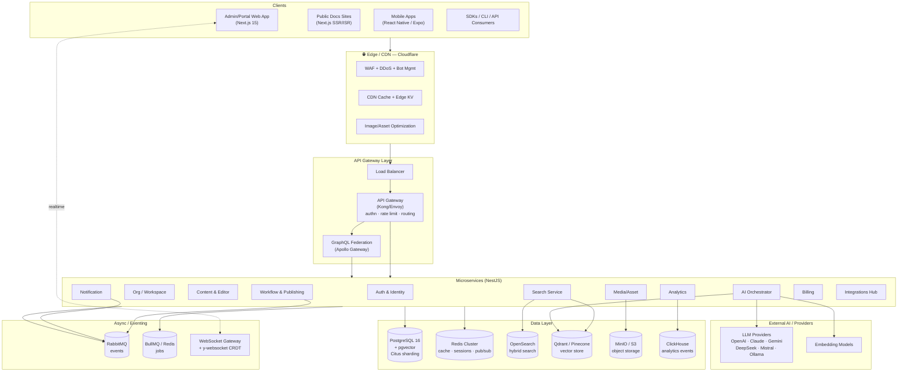

---

## 2. Frontend Architecture

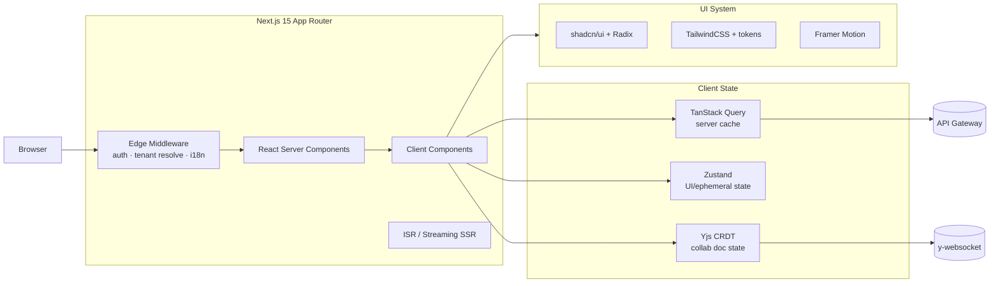

**Key decisions:** RSC for read-heavy reader/portal pages (SEO + speed); client components for editor/dashboards; Edge Middleware resolves tenant from host/subdomain, enforces auth, sets locale; ISR + on-demand revalidation for published docs.

---

## 3. Backend / Microservices Architecture

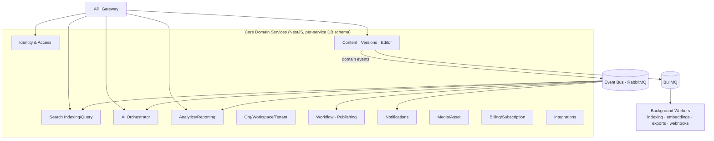

**Patterns:** Domain-driven bounded contexts · database-per-service (logical schema isolation, shared cluster) · transactional outbox for reliable events · CQRS for analytics read models · saga orchestration for cross-service workflows (publish, org-provisioning).

---

## 4. Database Architecture

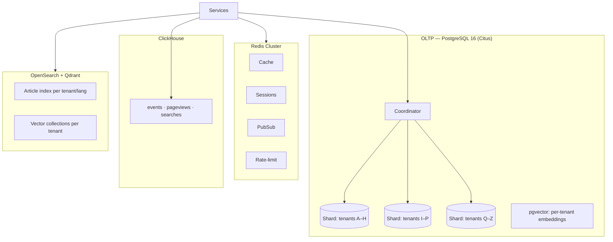

**Tenancy model:** Hybrid — **shared DB with `tenant_id` on every row + Postgres Row-Level Security (RLS)**, sharded by `tenant_id` via Citus for horizontal scale. Enterprise/regulated tenants can be promoted to **dedicated schema or dedicated cluster** (data residency). Read replicas per region.

---

## 5. Search Engine Architecture

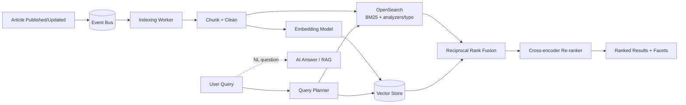

**Hybrid search:** keyword (BM25, synonyms, typo tolerance, language analyzers) + dense vector retrieval, fused via **RRF**, optionally re-ranked by a cross-encoder; NL questions route to RAG for a direct answer with citations. Per-tenant, per-language indices; permission-filtered at query time.

---

## 6. AI Services Architecture

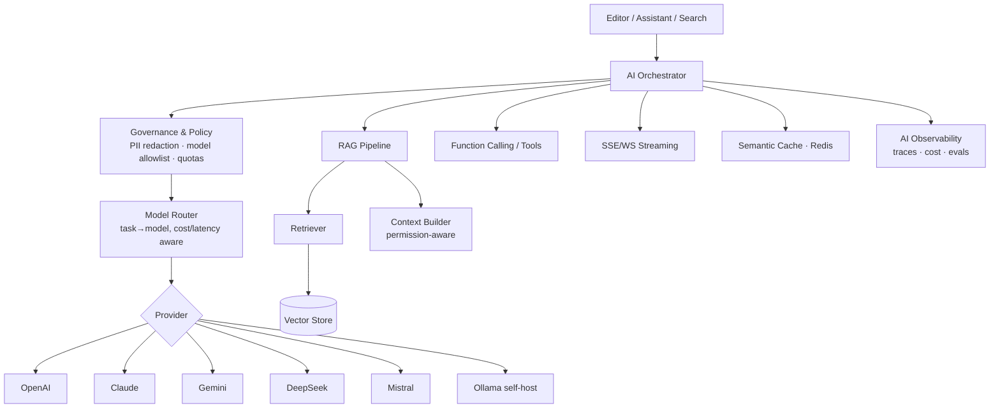

See [`09-ai-architecture.md`](09-ai-architecture.md) for full detail (RAG, BYO-LLM, governance, evals).

---

## 7. Authentication Architecture

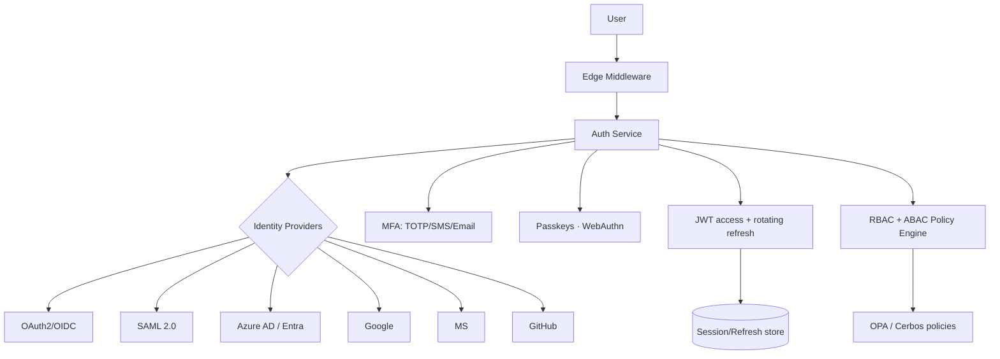

Access = short-lived JWT (15m) + rotating refresh (device-bound); SSO via SAML/OIDC per org; SCIM 2.0 for user provisioning; step-up MFA for sensitive actions.

---

## 8. CDN & Storage Architecture

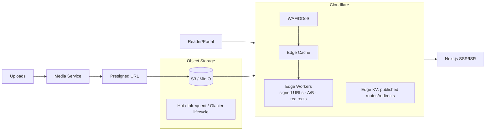

Direct-to-S3 presigned uploads; virus scan + MIME validation; automatic image transcode (AVIF/WebP) and responsive derivatives; CDN in front of both static assets and rendered pages.

---

## 9. Analytics Pipeline

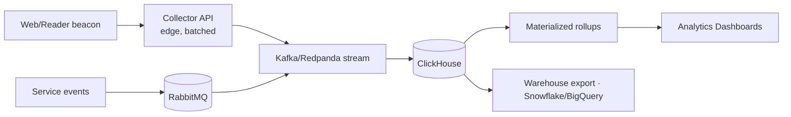

Privacy-first (cookieless option, IP anonymization, DNT honored). Event schema versioned; rollups for views/searches/feedback; real-time + historical.

---

## 10. Notification Services

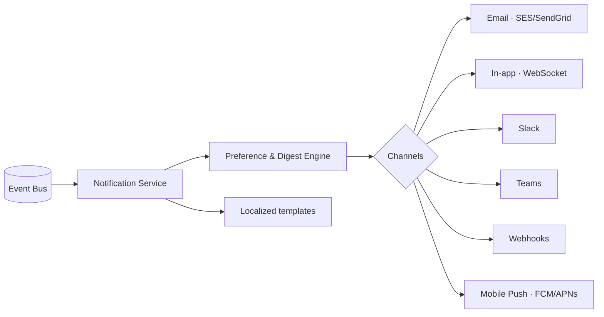

Deduplication, batching/digests, quiet hours, per-user + per-workspace preferences, delivery tracking with retries (BullMQ).

---

## 11. Queue Services

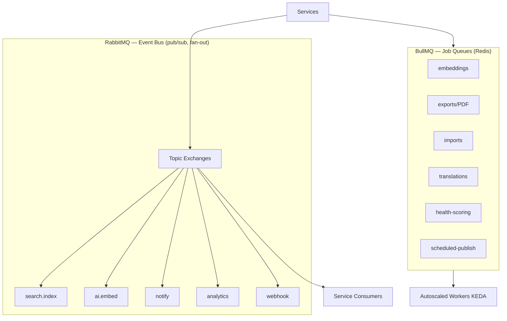

**RabbitMQ** = inter-service domain events (at-least-once, DLQ, idempotent consumers). **BullMQ** = scheduled/retryable background jobs with priorities, rate limiting, and KEDA-driven worker autoscaling.

---

## 12. Load Balancer & API Gateway

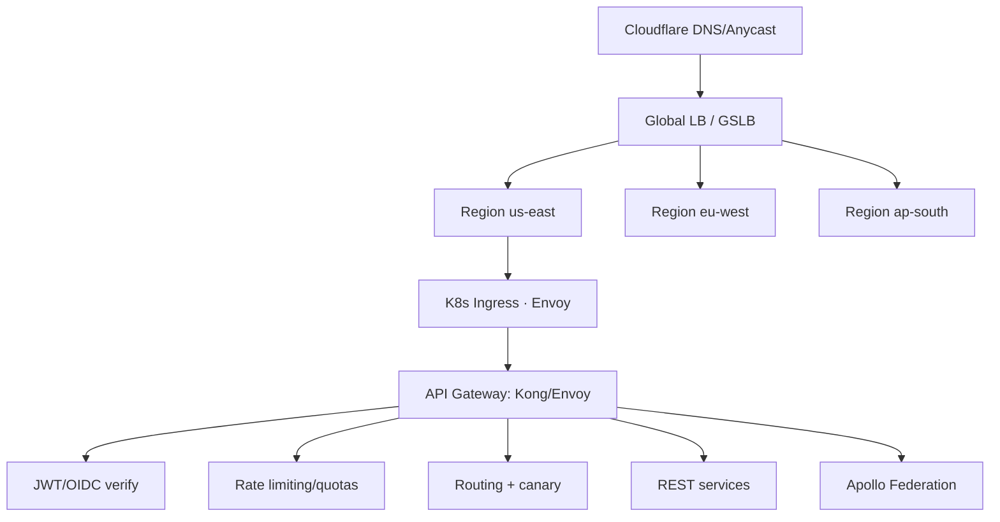

Layer-7 gateway handles authn, per-tenant/per-key rate limiting, request validation, canary/blue-green routing, and observability (OpenTelemetry). GraphQL federation composes a single supergraph from subgraph services.

---

## 13. Deployment Topology (multi-region)

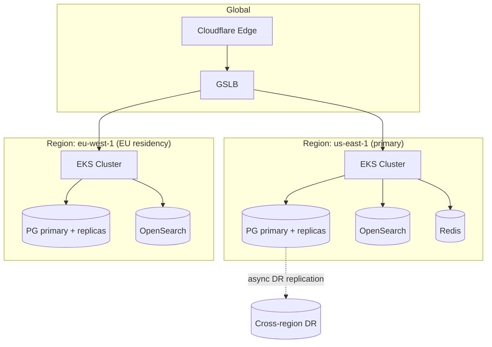

Active-active by region with tenant residency pinning; per-region data planes; global control plane for provisioning/billing. See [`11-infrastructure-architecture.md`](11-infrastructure-architecture.md) and [`16-scaling-strategy.md`](16-scaling-strategy.md).
